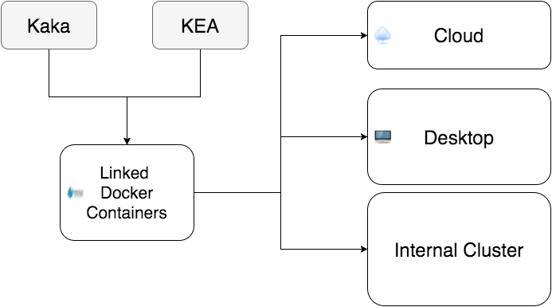
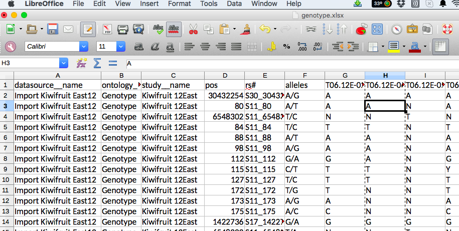
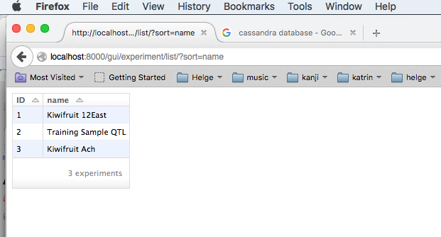

Genotype Data in PFR
========================================================

\begin{columns}
\begin{column}{0.48\textwidth}
\begin{itemize}
\item Many species: Kiwifruit, Apple, Pear, Potato, Grape, ...
\item Divers genotype data: GBS, QTL. ...
\item The data is semi structured
\end{itemize}
\end{column}
\begin{column}{0.48\textwidth}
\includegraphics{images/red_fleshed_apple_large}
\end{column}
\end{columns}


PFR Wetware Distribution
========================================================

\begin{columns}
\begin{column}{0.48\textwidth}
\begin{itemize}
\item 14 PFR sites in NZ
\item Data exchange across sites challenging
\item Analysts distributed as well
\end{itemize}
\end{column}
\begin{column}{0.48\textwidth}
\includegraphics{images/pfr_nz}
\end{column}
\end{columns}


Current way of "Sharing"
========================================================

\begin{columns}
\begin{column}{0.48\textwidth}
\begin{itemize}
\item The K-Drive
\item Excel Sheets
\end{itemize}
\end{column}
\begin{column}{0.48\textwidth}
\includegraphics{images/science_thunder}
\end{column}
\end{columns}

Database Initiatives in PFR
========================================================

* EBrida (commercial breeder's DB)
* Kea (inhouse sample tracking)
* Ensembl (Genome Browsing)
* Kaka (Genotypes concentrates on samples)
* Kakapo (Locations)
* ...

Kaka
========================================================

\begin{columns}
\begin{column}{0.48\textwidth}
\begin{itemize}
\item Supplement to Kea
\item Python Django
\item PGSQL and JSON (NoSQL)
\item Continuous integration
\item Containerisation
\item Needs location  (Chr, location on Chromosome)
\end{itemize}
\end{column}
\begin{column}{0.48\textwidth}
\includegraphics[width=2cm,height=2cm,keepaspectratio]{images/python-django.png}\\
\includegraphics[width=2cm,height=2cm,keepaspectratio]{images/pgsql.png}\\
\includegraphics[width=2cm,height=2cm,keepaspectratio]{images/docker.png}\\
\includegraphics[width=2cm,height=2cm,keepaspectratio]{images/travis_cl.png}\\
\end{column}
\end{columns}

Distributed DB
======================================================



Querying via API
======================================================

```
http://localhost/report/genotype/xlsx/?experiment=12East
http://localhost/report/genotype/csv/?experiment=12East
http://localhost/gui/genotype/list/
```

Screenshots
======================================================




Screenshots
======================================================


Screenshots
======================================================




Screenshots
======================================================


Conclusions
========================================================

* Genotype and phenotype information in one database
* It is a great tool already but needs a nerd
* It needs some input from the research community
* Kea needs to be attached as a docker container
* The data input is very manual
* It needs an interface to Ensembl


Thank you! Questions?
========================================================


